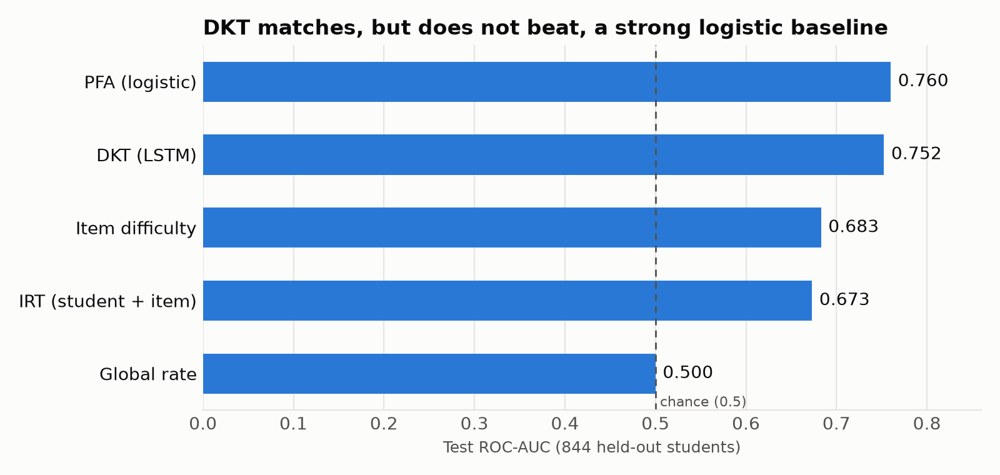
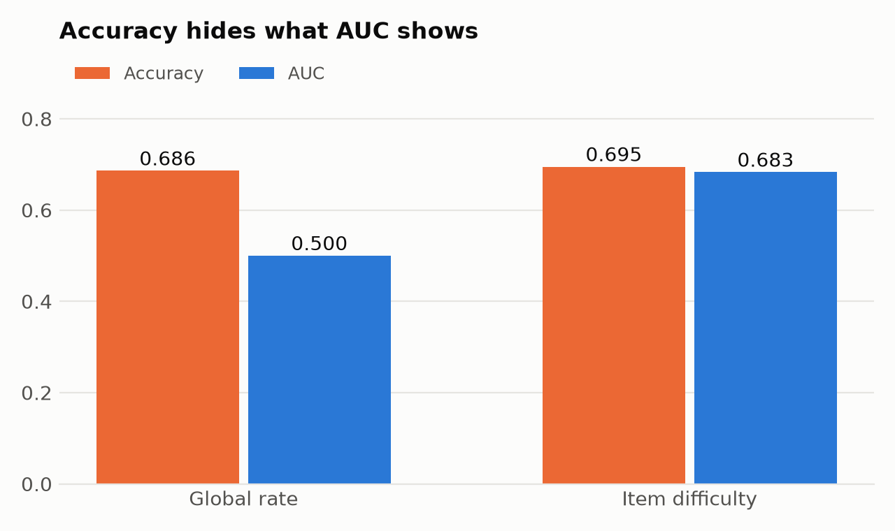

# masar: Knowledge Tracing on ASSISTments 2009

Predicting whether a student will answer their *next* math problem correctly, from the sequence of problems they have already answered. I built a ladder of models from trivial baselines up to a Deep Knowledge Tracing (DKT) LSTM, with a leak-free evaluation at every step.

## Key finding

With a strict student-level, time-respecting split, a tuned DKT (test AUC ~0.75) **matches but does not beat** a well-built logistic-regression baseline with per-skill history features (PFA, 0.760). It decisively beats item-only and IRT baselines. This agrees with the published finding in *How Deep is Knowledge Tracing?*

Most of the gain came from features that describe a student's history, not from model complexity. DKT overfit quickly (training loss kept falling while test AUC dropped), so it needed a validation split and early stopping to reach its result.

I did not test how these models behave as the amount of training data changes, so I make no claim about low-data settings. That is the next experiment (below).

## Results

All numbers are ROC-AUC on held-out **students** (844 test students, never seen in training).

| Version | Model | Test AUC |
|---|---|---|
| v0 | Global correct rate | 0.500 |
| v0 | Per-item difficulty | 0.683 |
| v1 | IRT (student + item one-hot) | 0.673 |
| v1 | PFA-style logistic regression (item difficulty + running accuracy + per-skill running accuracy) | **0.760** |
| v3 | DKT (Embedding → LSTM(64) → Linear), early-stopped on validation | 0.752 to 0.758 |

The DKT range covers separate runs; the notebook's final run gives 0.7525.



**Accuracy hides what AUC shows.** About 68% of interactions are correct, so a model that always predicts the global rate scores 0.686 accuracy but 0.500 AUC. Per-item difficulty scores 0.695 accuracy and 0.683 AUC. Always look at AUC.



## What I did

- **v0, baselines.** Global rate and per-item mean, computed from the training split only. Item means for items unseen in training fall back to the global rate.
- **v1, IRT.** Student and item one-hot logistic regression. It scored *below* the item baseline (0.673 vs 0.683): because whole students are held out, every test student's ability parameter is unseen and never activates. A fixed per-student parameter is useless for a new student, so ability has to be inferred from the student's own history.
- **v1, PFA.** Logistic regression on transferable features: item difficulty, the student's running accuracy, and running accuracy on the current skill. Each running feature is computed *before* the current row (cumulative sum minus the current answer), so the future never leaks in. This reached 0.760.
- **v3, DKT.** An LSTM reads the sequence of (skill, correct) tokens and predicts the next response. Training for too long overfit (train loss fell while test AUC fell), so I carved out a validation split, used early stopping, and kept the best epoch.
- **Skipped / not done:** v2 (BKT), v4 (attention: SAKT/AKT) and v5 (recovering the skill prerequisite graph). See below.

## Methodology: avoiding leakage

- **Split by student**, not by row: 3,373 train / 844 test students, with no overlap (verified). DKT additionally holds out 15% of the training students as a validation set.
- **Respect time:** features for step *t* use only steps before *t*.
- **No test-set tuning:** the DKT epoch count is chosen on a separate validation split carved from the training students.
- A `MAX_LEN` of 500 instead of 200 did not help, so I stopped tuning rather than keep peeking at the test set.

## Data

The dataset is **not included** in this repo. Download `skill_builder_data.csv` (ASSISTments 2009-2010 "skill builder", the **uncorrected** version) from the [official ASSISTments data page](https://sites.google.com/site/assistmentsdata/home/2009-2010-assistment-data), and check their terms of use and citation requirements before reusing it.

Place it at `data/skill_builder_data.csv`. Notes for loading:

- The file is not UTF-8: use `encoding="latin-1"`.
- Use `low_memory=False` to avoid a mixed-type warning on `skill_name`.
- The raw file has ~34% duplicate rows (problems tagged with several skills are repeated once per skill). De-duplicating on `order_id` takes it from 525,534 rows to 346,860 real interactions. All results above use the de-duplicated data.

After de-duplication: 4,217 students, 26,688 problems, 123 skills.

**Attribution:** data from the ASSISTments 2009-2010 skill-builder dataset, which its maintainers describe as free to use. Their request for anyone citing it is to include a link to the [data page](https://sites.google.com/site/assistmentsdata/home/2009-2010-assistment-data). See also their terms-of-use page linked from that site.

## Reproduce

```bash
conda create -n masar python=3.12
conda activate masar
pip install -r requirements.txt
jupyter lab
```

Then open `01_eda_baselines.ipynb` and run it top to bottom. Training is CPU-only.

## Not done / next

- **Data-size experiment (hypothesis, not yet tested):** DKT has tens of thousands of weights and PFA has three features, so I expect DKT to degrade faster than PFA as training data shrinks. Plan: subsample the training *students* at 100%, 50%, 25% and 10%, repeat each size with several random draws, train both models with the same validation and test sets, and plot test AUC against training size. A result where DKT holds up as well as PFA on small data would contradict my expectation and be worth reporting.
- **v2 BKT** and **v4 attention (SAKT/AKT)** were not built.
- **v5:** probe the trained DKT for the skill prerequisite structure it learned, and compare it to a ground-truth graph (Junyi Academy ships one). Because Junyi has different skills from ASSISTments, this means training on Junyi.

The original plan is in [docs/project-brief.md](docs/project-brief.md).

## How I worked on this

This is a learning project. I used Claude (Anthropic) as a mentor rather than a code generator: it explained concepts (leakage, AUC, IRT, DKT), asked questions, reviewed my code and results, and pushed back on claims my experiments didn't support. I wrote the modelling code and ran every experiment myself. Claude also helped with repository housekeeping (cleaning the git history, the license and this README's structure).

## License

MIT. See [LICENSE](LICENSE). The license covers the code and write-up in this repo only, not the ASSISTments dataset, which has its own terms.
